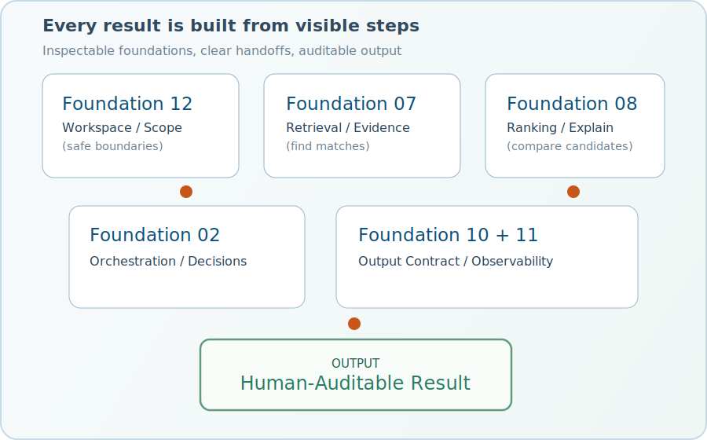

---
hide:
  - navigation
  - toc
---

<style>
  .md-header,
  .md-tabs {
    display: none;
  }

  .md-main {
    margin-top: 0;
  }
</style>

<div class="forge-lang-switch forge-lang-switch--global" aria-label="Language selection">
  <a class="is-active" href="./">EN</a>
  <span>•</span>
  <a href="../de/">DE</a>
  <span>•</span>
  <button type="button" class="forge-theme-toggle" data-forge-theme-toggle aria-label="Toggle theme">Dark</button>
</div>
<section class="forge-hero">
  <div class="forge-hero__copy">
    <h1>Forge - Your AI Repo Workbench</h1>
    <p class="forge-lead">
      With control, not magic. Forge helps you query, review, test, and improve repositories with explicit steps, visible evidence, and auditable outputs.
    </p>
    <p class="forge-subline">No black box. No hidden jumps. Just visible repo work: query, explain, review, propose.</p>
    <div class="forge-hero__actions">
      <a class="md-button md-button--primary" href="getting-started.md">Get Started</a>
      <a class="md-button" href="core-commands.md">See Commands</a>
    </div>
    <div class="forge-hero__example">
      <strong>Example:</strong> You ask <code>"Where is session TTL configured?"</code>. Forge finds the matching files, shows the relevant lines, explains why they matter, and keeps every step traceable for review and safe changes.
    </div>
  </div>
  <div class="forge-hero__visual">
    
  </div>
</section>

## Why Forge

<div class="forge-card-grid">
  <article class="forge-card">
    <div class="forge-card__row">
      <div class="forge-card__icon" aria-hidden="true">
        <svg viewBox="0 0 24 24"><path d="m12 16 7.36-5.73L21 9l-9-7-9 7 1.63 1.27M12 18.54l-7.38-5.73L3 14.07l9 7 9-7-1.63-1.27z"/></svg>
      </div>
      <div class="forge-card__body">
        <h3>Explicit Modes</h3>
        <p>Mode behavior stays understandable: query, review, describe, test.</p>
      </div>
    </div>
  </article>
  <article class="forge-card">
    <div class="forge-card__row">
      <div class="forge-card__icon" aria-hidden="true">
        <svg viewBox="0 0 24 24"><path d="m10 17-4-4 1.41-1.41L10 14.17l6.59-6.59L18 9m-6-8L3 5v6c0 5.55 3.84 10.74 9 12 5.16-1.26 9-6.45 9-12V5z"/></svg>
      </div>
      <div class="forge-card__body">
        <h3>Human-Auditable</h3>
        <p>Outputs are grounded in paths, matches, diagnostics, and traceable decisions.</p>
      </div>
    </div>
  </article>
  <article class="forge-card">
    <div class="forge-card__row">
      <div class="forge-card__icon" aria-hidden="true">
        <svg viewBox="0 0 24 24"><path d="M20.5 11H19V7a2 2 0 0 0-2-2h-4V3.5A2.5 2.5 0 0 0 10.5 1 2.5 2.5 0 0 0 8 3.5V5H4a2 2 0 0 0-2 2v3.8h1.5c1.5 0 2.7 1.2 2.7 2.7S5 16.2 3.5 16.2H2V20a2 2 0 0 0 2 2h3.8v-1.5c0-1.5 1.2-2.7 2.7-2.7s2.7 1.2 2.7 2.7V22H17a2 2 0 0 0 2-2v-4h1.5a2.5 2.5 0 0 0 2.5-2.5 2.5 2.5 0 0 0-2.5-2.5"/></svg>
      </div>
      <div class="forge-card__body">
        <h3>Composable Foundations</h3>
        <p>Advanced workflows are built from inspectable core foundations.</p>
      </div>
    </div>
  </article>
  <article class="forge-card">
    <div class="forge-card__row">
      <div class="forge-card__icon" aria-hidden="true">
        <svg viewBox="0 0 24 24"><path d="m13.13 22.19-1.63-3.83c1.57-.58 3.04-1.36 4.4-2.27zM5.64 12.5l-3.83-1.63 6.1-2.77C7 9.46 6.22 10.93 5.64 12.5M21.61 2.39S16.66.269 11 5.93c-2.19 2.19-3.5 4.6-4.35 6.71-.28.75-.09 1.57.46 2.13l2.13 2.12c.55.56 1.37.74 2.12.46A19.1 19.1 0 0 0 18.07 13c5.66-5.66 3.54-10.61 3.54-10.61m-7.07 7.07c-.78-.78-.78-2.05 0-2.83s2.05-.78 2.83 0c.77.78.78 2.05 0 2.83s-2.05.78-2.83 0m-5.66 7.07-1.41-1.41zM6.24 22l3.64-3.64c-.34-.09-.67-.24-.97-.45L4.83 22zM2 22h1.41l4.77-4.76-1.42-1.41L2 20.59zm0-2.83 4.09-4.08c-.21-.3-.36-.62-.45-.97L2 17.76z"/></svg>
      </div>
      <div class="forge-card__body">
        <h3>Useful by Default</h3>
        <p>Strong defaults, optional configuration, and local-first repository workflows.</p>
      </div>
    </div>
  </article>
</div>

## Quick CLI Example

```bash
forge query "Where is session TTL configured?"
forge review src/checkout.py --focus reliability
forge describe core/workspace_foundation.py
```

## Choose your entry point based on time and goal

<div class="forge-start-grid">
  <article class="forge-start-card forge-start-card--quick">
    <h3>Quick Start</h3>
    <pre><code>python3 -m venv .venv
source .venv/bin/activate
python -m pip install --upgrade pip
python -m pip install -e .
forge init --non-interactive --template typo3-v14
forge query "Where is the runtime settings resolver implemented?"</code></pre>
  </article>
  <article class="forge-start-card forge-start-card--setup">
    <h3>Installation and Setup</h3>
    <ul>
      <li><a href="getting-started.md">Guided Setup</a></li>
      <li><a href="installation.md">Installation</a></li>
      <li><a href="llm-setup.md">LLM Setup</a></li>
    </ul>
  </article>
  <article class="forge-start-card forge-start-card--docs">
    <h3>Documentation</h3>
    <p>Navigate user docs, developer foundations, and the full open-source repository.</p>
    <ul>
      <li><a href="./">User Documentation</a></li>
      <li><a href="https://github.com/tino-koenig/forge/tree/main/docs/developer">Developer Documentation</a></li>
      <li><a href="https://github.com/tino-koenig/forge">GitHub Repository</a></li>
    </ul>
  </article>
  <article class="forge-start-card forge-start-card--trust forge-trust-card">
    <h3>Trust, Safety, Openness</h3>
    <p>Forge is built to stay inspectable, bounded, and usable in real environments with explicit rules, visible limits, and auditable behavior.</p>
    <ul>
      <li><strong>Developer Documentation:</strong> Foundations, contracts, and architecture notes live in <code>docs/developer/</code>.</li>
      <li><strong>Trust &amp; Safety:</strong> <a href="trust-and-safety.md">Rules, safeguards, and boundaries</a> are explicit and enforceable.</li>
      <li><strong>Logging &amp; Limits:</strong> Runtime limits and diagnostics remain visible in <a href="runtime-settings-and-sessions.md">Runtime Settings &amp; Sessions</a>.</li>
      <li><strong>LLM Providers &amp; Local LLM:</strong> OpenAI-compatible endpoints are documented in <a href="llm-setup.md">LLM Setup</a>.</li>
      <li><strong>Open Source (MIT):</strong> Forge is fully open and auditable under the MIT license.</li>
    </ul>
  </article>
</div>
